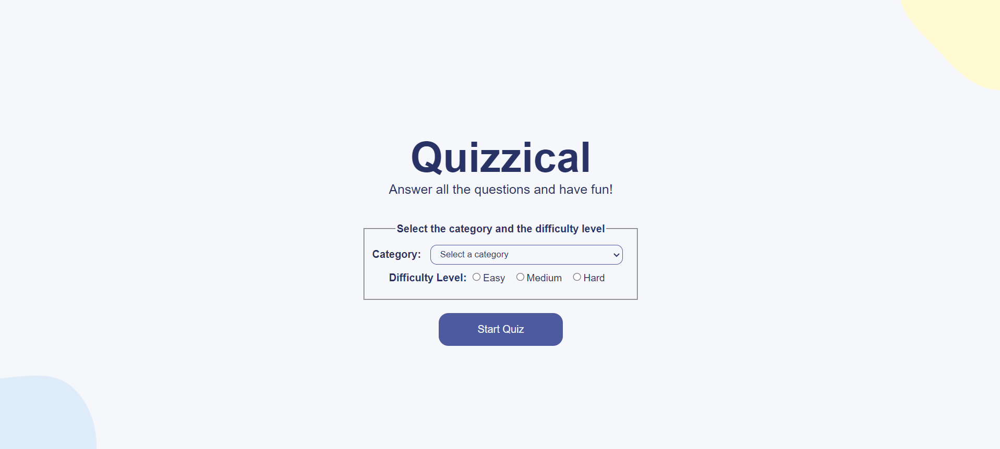
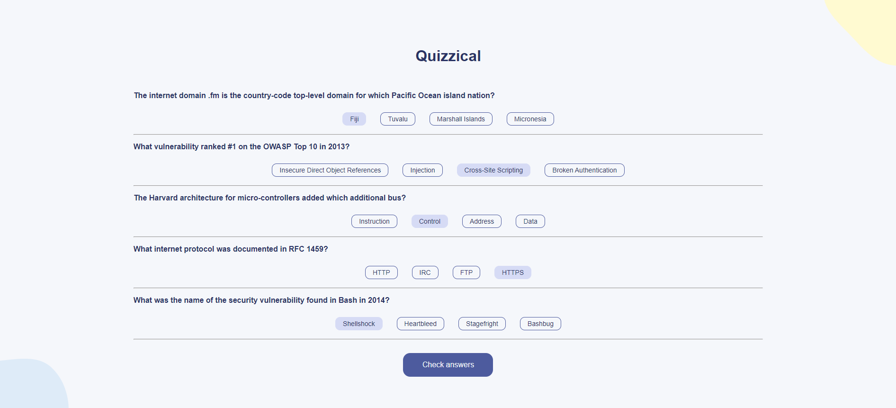
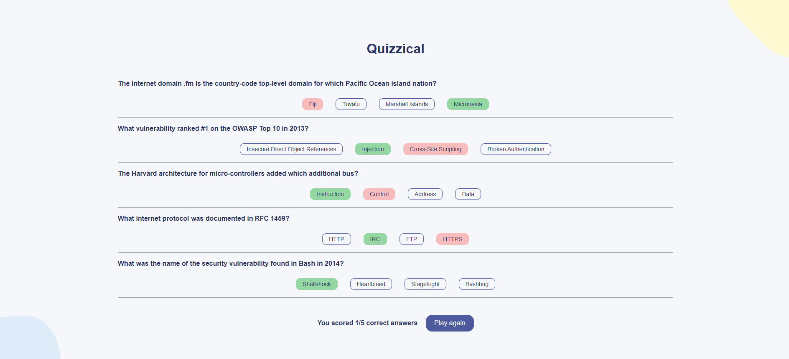

# Quizzical
Quizzical is an app that pulls trivia questions from the [Open Trivia Database API](https://opentdb.com/) and scores players based on their answers. Players can customize their game experience by selecting different difficulty levels and categories.

This is the final [Solo Project of React Course on Scrimba](https://scrimba.com/learn/learnreact) developed from scratch by me and following the designed provided on this [Figma file](https://www.figma.com/file/E9S5iPcm10f0RIHK8mCqKL/Quizzical-App?node-id=0%3A1).

## Table of contents

- [Overview](#overview)
  - [The challenge](#the-challenge)
  - [Screenshots](#screenshots)
- [Getting Started with Create React App](#getting-started-with-create-react-app)
    
## Overview

### The challenge

Create a Quiz using React.JS framework and its functionalities.

### Screenshots

# Getting Started with Create React App

This project was bootstrapped with [Create React App](https://github.com/facebook/create-react-app).

## Available Scripts

In the project directory, you can run:

### `npm start`

Runs the app in the development mode.\
Open [http://localhost:3000](http://localhost:3000) to view it in your browser.

The page will reload when you make changes.\
You may also see any lint errors in the console.
